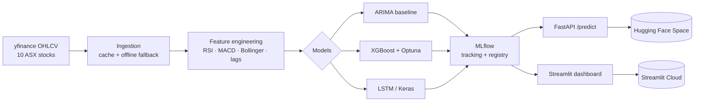

# 📈 ASX Stock-Price Forecasting with MLOps

> End-to-end ML system for forecasting Australian (ASX) equity prices — data ingestion → feature engineering → rigorous model comparison (ARIMA vs XGBoost vs LSTM) → experiment tracking → a prediction **API** and a live **dashboard**, all on free-tier infrastructure.

[](https://github.com/Sanny-Un-Sowadh-Wamik/stock-forecasting-mlops/actions/workflows/ci.yml)


[](https://sanny2005-asx-stock-forecaster.hf.space)

**🔴 Live demo (no login):** **[▶ Open the interactive dashboard](https://sanny2005-asx-stock-forecaster.hf.space)** — Hugging Face Space · _FastAPI `/docs` coming next_

---

## 🎯 What this project demonstrates

- **Full ML lifecycle** — raw data through to a deployed, documented prediction service.
- **Rigorous time-series modelling** — a naïve persistence baseline and ARIMA benchmark, beaten by tuned XGBoost and an LSTM, all evaluated with **walk-forward validation** (no look-ahead leakage).
- **MLOps practice** — MLflow experiment tracking + model registry, a reproducible `uv`-managed environment, and GitHub Actions CI.
- **Production serving** — a FastAPI `/predict` endpoint (auto-generated OpenAPI docs) and a Streamlit dashboard with candlestick + forecast overlays.

## 🏗️ Architecture



## 🧰 Tech stack

| Layer | Tool |
|---|---|
| Data ingestion | `yfinance` (cached to Parquet) |
| Feature engineering | pandas / numpy (hand-rolled indicators) |
| Models | `statsmodels` (ARIMA), `xgboost` + `optuna`, `tensorflow` (LSTM) |
| Experiment tracking | MLflow + Model Registry |
| API | FastAPI + Uvicorn |
| Dashboard | Streamlit + Plotly |
| Tooling | `uv`, `ruff`, `mypy`, `pytest`, GitHub Actions |
| Hosting (free tier) | Streamlit Community Cloud · Hugging Face Spaces |

## 📁 Project structure

```
01-stock-forecasting-mlops/
├── config/config.yaml          # tickers, feature + model params (typed via pydantic)
├── src/stockfc/                # importable package
│   ├── config.py               # typed config + secrets loading
│   ├── data/ingest.py          # yfinance pull, caching, offline fallback
│   ├── features/technical.py   # RSI, MACD, Bollinger, lags (pure pandas)
│   └── models/                 # ARIMA / XGBoost / LSTM + evaluation + registry
├── api/                        # FastAPI prediction service
├── dashboard/                  # Streamlit app
├── tests/                      # pytest suite
├── scripts/                    # pipeline entry points
├── .github/workflows/          # CI
└── Dockerfile                  # reproducible serving image (Python 3.11)
```

## 🚀 Quickstart

```bash
# 1. Create the environment (uv installs Python 3.11 + deps from a shared cache)
uv venv --python 3.11
uv pip install -e ".[models,api,app,dev]"

# 2. Sanity-check the data + feature pipeline
python scripts/smoke_test.py

# 3. (later) Build the dataset, train + log models, serve the API and dashboard
make data && make train && make api && make app
```

## 📊 Results

Pooled across all 10 tickers (**18,460 samples**), evaluated on a **walk-forward hold-out** — train ≤ 2024-12-09, test 2024-12-10 → present (**3,700 days**). Target = next-day log-return; price is reconstructed for an apples-to-apples RMSE against ARIMA.

| Model | Price RMSE ↓ | Price MAPE ↓ | Return RMSE ↓ | Directional Acc. ↑ |
|---|--:|--:|--:|--:|
| Persistence (random walk) | **1.696** | **1.07%** | **0.01570** | 1.8% |
| ARIMA(5,1,0) | 1.743 | 1.08% | 0.01592 | 48.8% |
| **XGBoost (Optuna-tuned)** | 1.710 | 1.07% | 0.01578 | **51.8%** |
| LSTM (Keras) | 2.901 | 1.31% | 0.02008 | 50.4% |

**How to read this — the honest version:**
- On **daily price RMSE the random walk wins** — exactly what efficient-market theory predicts. A model that "beats" it by a wide margin is almost always leaking the future. Ours isn't, and that's the point.
- The useful signal is **directional accuracy**: the tuned **XGBoost reaches 51.8%**, beating the ARIMA benchmark (48.8%) and a 50% coin-flip — a small but real edge that the dashboard renders as an out-of-sample equity curve.
- The **LSTM underperforms** here (worst price RMSE, ~coin-flip direction): extra capacity doesn't help on near-random-walk daily returns. Reporting this is deliberate — model selection by **evidence, not hype**.
- **XGBoost is the registered & served model** (`asx-forecaster` in the MLflow registry): best ML accuracy, millisecond inference, and no deep-learning runtime in the serving image.

> Reproducible (seed-fixed): `python scripts/train.py && python scripts/train_lstm.py`

### 📌 Résumé bullet
> Built an end-to-end MLOps forecasting system for 10 ASX equities (18k+ samples): leakage-free, walk-forward-validated comparison of random-walk, ARIMA, Optuna-tuned XGBoost and LSTM models; served the best model via a FastAPI endpoint + Streamlit dashboard with MLflow tracking & model registry, a pytest suite and GitHub Actions CI — deployed on $0 free-tier infrastructure.

## 📝 Notes on free-tier hosting

The original brief targeted Railway, which no longer offers a meaningful free tier. This project deploys to **Streamlit Community Cloud** (dashboard) and **Hugging Face Spaces** (Dockerised API) instead — a deliberate cost-engineering choice, $0/month, with permanent shareable URLs.

## 🔭 Next steps

- News-**sentiment** feature (VADER over NewsAPI headlines) as an optional signal.
- Probability-calibrated **directional classifier** + cost-aware backtest (fees / slippage).
- Nightly retrain via GitHub Actions + **drift monitor** (alert if rolling RMSE breaches a threshold).
- Champion–challenger promotion gate through the MLflow model registry.

## 📄 License

MIT — © 2026 Sanny Un Sowadh Wamik
